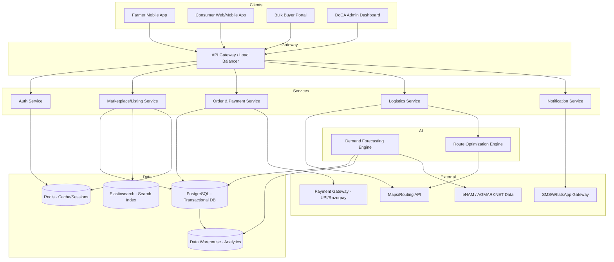
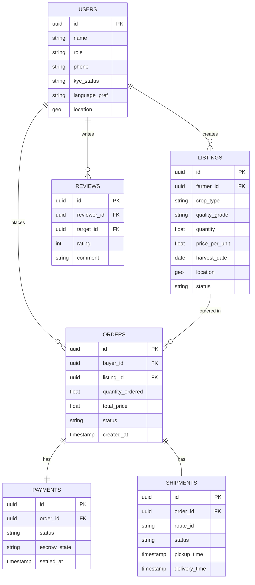

# System Architecture — AgriDirect (SIH26033)

## 1. High-Level Architecture

## 2. Component Breakdown

### 2.1 Client Layer
- **Farmer Mobile App:** Lightweight, offline-first (React Native/Flutter), supports SMS/IVR fallback, multilingual + voice UI.
- **Consumer Web/Mobile App:** Standard e-commerce style browsing/checkout experience.
- **Bulk Buyer Portal:** Web dashboard for RFQ, bulk order scheduling, and invoicing.
- **DoCA Admin Dashboard:** Web dashboard for market intelligence, price trends, and dispute oversight.

### 2.2 API Gateway
- Single entry point handling routing, authentication token validation, rate limiting, and request logging.
- Recommended: Kong, NGINX, or AWS API Gateway.

### 2.3 Core Services (microservice-oriented, can start as a modular monolith for the hackathon)
| Service | Responsibility |
|---|---|
| Auth Service | Registration, OTP/JWT auth, role-based access (Farmer/Buyer/Admin/Logistics) |
| Marketplace/Listing Service | CRUD for produce listings, search/filter, categorization |
| Order & Payment Service | Cart/checkout, RFQ/negotiation, escrow payment orchestration |
| Logistics Service | Pickup/delivery scheduling, shipment tracking, 3PL integration |
| Notification Service | SMS/WhatsApp/push notifications for order & price events |

### 2.4 AI/ML Layer
- **Demand Forecasting Engine:** Python (FastAPI) microservice using time-series models (e.g., Prophet, ARIMA, or gradient-boosted trees) trained on historical order volume, mandi price data (AGMARKNET/eNAM), and weather data.
- **Route Optimization Engine:** Solves a Vehicle Routing Problem (VRP) using Google OR-Tools to consolidate multiple farmer pickups into efficient logistics routes.

### 2.5 Data Layer
- **PostgreSQL:** Primary transactional store (users, listings, orders, payments).
- **Redis:** Session caching, rate limiting, real-time order status.
- **Elasticsearch:** Full-text/faceted search over produce listings.
- **Data Warehouse (e.g., BigQuery/Redshift, optional for MVP):** Aggregated data for analytics dashboards and ML training.

### 2.6 External Integrations
- Payment Gateway (Razorpay/UPI) for transactions and escrow.
- SMS/WhatsApp Business API (Twilio, MSG91, Gupshup) for low-bandwidth notifications.
- Maps/Routing API (Google Maps or OSRM/OpenStreetMap) for geolocation and route computation.
- eNAM / AGMARKNET public datasets for price benchmarking and forecasting model training.

## 3. Data Flow (Order Lifecycle Example)

1. Farmer lists produce → stored in Marketplace Service → indexed in Elasticsearch.
2. Buyer searches/filters → Marketplace Service returns matching listings.
3. Buyer places order → Order Service creates order, initiates payment hold via Payment Gateway (escrow).
4. Logistics Service assigns pickup, Route Optimization Engine computes consolidated route.
5. Shipment status updates flow through Logistics Service → Notification Service → Farmer/Buyer apps.
6. On delivery confirmation, Order Service releases escrow payment to farmer's linked account.
7. Transaction data flows to Data Warehouse for analytics and feeds back into the Demand Forecasting Engine.

## 4. High-Level Database Schema (Simplified)

## 5. Deployment View

- **Containerization:** Docker for all services; docker-compose for local dev.
- **Orchestration (production):** Kubernetes (or a managed alternative like AWS ECS) for scaling services independently during seasonal load spikes.
- **CI/CD:** GitHub Actions — lint/test on PR, build/push Docker images, deploy to staging/production.
- **Environments:** `dev` → `staging` → `production`, with separate databases and secrets per environment.
- **Monitoring:** Prometheus + Grafana for metrics; ELK/EFK stack or a hosted alternative (e.g., Datadog) for logs.

## 6. Security Considerations

- JWT-based auth with short-lived access tokens + refresh tokens.
- Role-based access control (Farmer, Buyer, Admin, Logistics Partner).
- TLS everywhere; encrypt sensitive PII (Aadhaar/KYC data) at rest.
- Escrow-based payment flow to reduce fraud risk for farmers.
- Compliance alignment with India's Digital Personal Data Protection (DPDP) Act, 2023.

## 7. Scalability Notes

- Seasonal traffic (harvest windows) requires horizontal auto-scaling on the Marketplace and Order services.
- Read-heavy search traffic is offloaded to Elasticsearch rather than the primary transactional DB.
- Demand forecasting and route optimization run as asynchronous batch/queued jobs, not inline with user requests, to keep API latency low.
